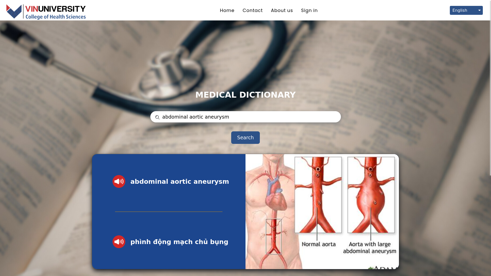
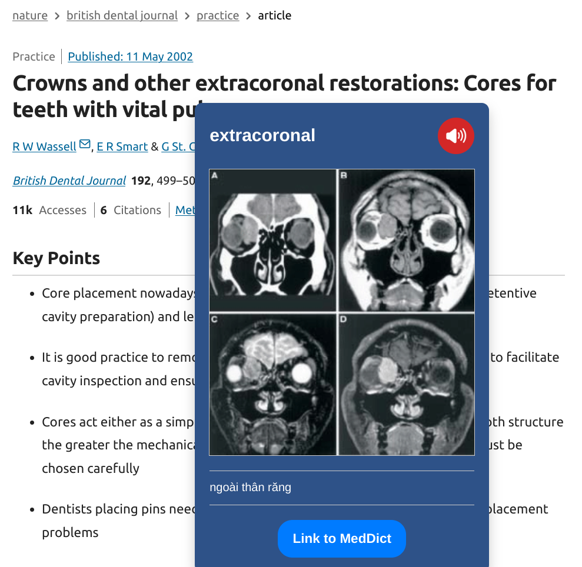
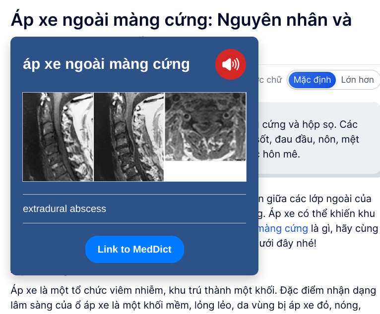
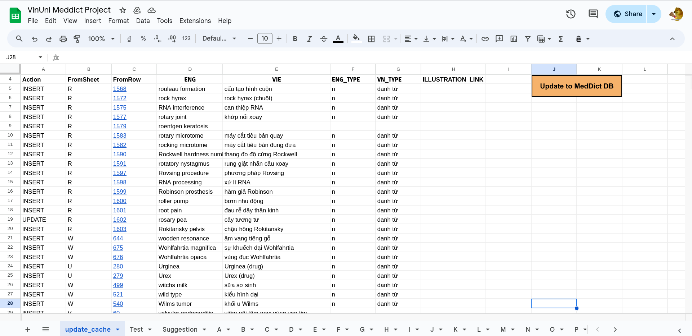

# Medical Dictionary 🏥📖

**MedDict** is a medical dictionary made by VinUnians for College of Health Sciences (CHS) students & faculties in VinUniversity. The dictionary is curated by Professor Huynh Dinh Chien, faculty of CHS at VinUniversity. 

## 🔍 Table of contents 
- [Features](#-features)
- [Installation](#-installation)
- [Usage](#-usage)
- [Development](#-development)
- [License](#-license)
- [Acknowledgement](#-acknowledgement)

## ✨ Features

### For end-users

- Search for both English/Vietnamese medical words to receive the corresponding words in the other language. 
- Provide sample illustrations to the words.
- With the MedDict plugin, you can search for words directly from your browser!
- Suggest words to the dictionary managers.

### For dictionary managers

- Integrated Dashboard to Google Spreadsheet, allowing dictionary managers to easily manage the dictionary directly from their familiar Google Spreadsheet interface.
- Update/Delete, or resolve suggestions from end-users.

## 🧐 Usage 

### Search from our website

The dictionary is available at [https://meddict-vinuni.com](https://meddict-vinuni.com). In here, you can search for medical terms, receiving the translation, pronunciation, and sample illustrations for the words.



### Search with the MedDict plugin

With the [MedDict plugin](https://github.com/linhledieu/MedDict-highlighter), you can search for words directly from your browser!

More interestingly, you DON'T need to specify source/target language. The plugin will automatically do the ✨ magic for you!





### For dictionary managers

We have integrated a standalone Apps Script into the Google Spreadsheet of the project, which can support dictionary managers to easily manage the dictionary directly from their familiar Google Spreadsheet interface.



## 👨‍🔧 Installation 

### Pre-requisite

Before installing the service, you need to have [Docker](https://docs.docker.com/) & [Docker Compose](https://docs.docker.com/compose/). Please visit their instalation guides before continuing. 

### Setup 

#### MedDict Website

1. Cloning the project with:
```bash
$ git clone https://github.com/tunglambg131003/COMP2030_Meddict
```
2. Create a `.env` file, which will configure the application's environment variables for storing secret passwords, keys, etc. The sample of the `.env` can be found at [`.env_sample`](./env_sample) file. We recommend using some password generator to create the credentials. 
3. Create a `mongo-init.js` file from [`sample_mongo-init.js`](./sample_mongo-init.js). Please change the Mongo username & password according to the key `MONGODB_USERNAME` & `MONGODB_PASSWORD` at the `.env` file that you created in step 1. 
4. Run the following command:

```Bash
$ docker compose up -d build
```
5. Create 
You are done! Access the service at `localhost` via your web browser if you are installing in local machine, or the server IP address/domain name if you are deploying it on a cloud instance.


#### MedDict Apps Script plugin

0. You should install [`clasp`](https://codelabs.developers.google.com/codelabs/clasp/#0) - The CLI tool for Google Apps Script.
1. `Optional`: Create a new Google Spreadsheet, in which you follow the format of the original MedDict VinUni Project template.
2. Open the Google Spreadsheet, and go to `Extensions` -> `Apps Script`. Collect the project ID of the project. `https://script.google.com/u/0/home/projects/<YOUR_PROJECT_ID_HERE>/`
3. Run the following command 
```bash
clasp login # login into your SpreadSheet Account
clasp clone $PROJECT_ID
```
4. Copy files from [apps_script](./apps_script/) folder. You can follow [this tutorial](https://developers.google.com/apps-script/guides/typescript) for using TypeScript during your development.
5. Run the following command to push your changes to the Google Spreadsheet
```bash
clasp push
```
6. You are done! You can now automate your editing process with the Google Spreadsheet.

## 👩‍💻 Development

Please refer to [DEVELOPMENT.md](./DEVELOPMENT.md) for more information.

## 📄 License

This project is using MIT License. 

## 🙏 Acknowledgement 

We want to say thank to COMP2030 - Software Construction's Instructor Team for helping us during the course, as well as Professor Huynh Dinh Chien & Mr. Hoang Mai Duy with their supports during the project. 